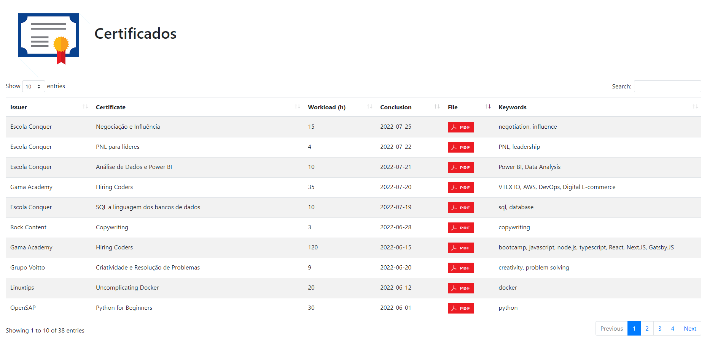

# Certificados

<a href="https://marcoscosta-cloud.github.io/certificados/" target="_blank">
    
</a>

Repositório com certificados de cursos, eventos e capacitações.

Certificates management using JavaScript on Github Pages with PDF download and keyword search on datatables.

URL: https://github.com/marcoscosta-cloud/certificados


<a href="https://www.linkedin.com/in/marcospcosta/">
    
</a>

## USAGE

Change the SERVER constant in the config.js with your full address of the certificates files.

```javascript
const SERVER = "https://github.com/marcoscosta-cloud/certificados/tree/main/files/"; 
```

Change the FILENAME constant in the config.js with your certificates list in CSV format.

```javascript
const FILENAME = "certificados.csv"; 
```
